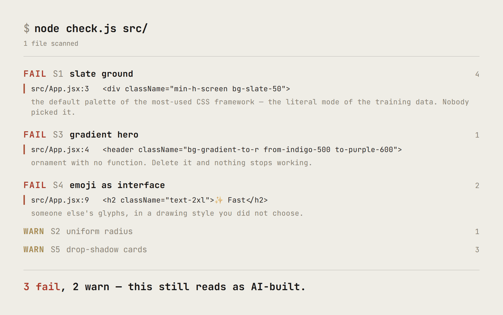
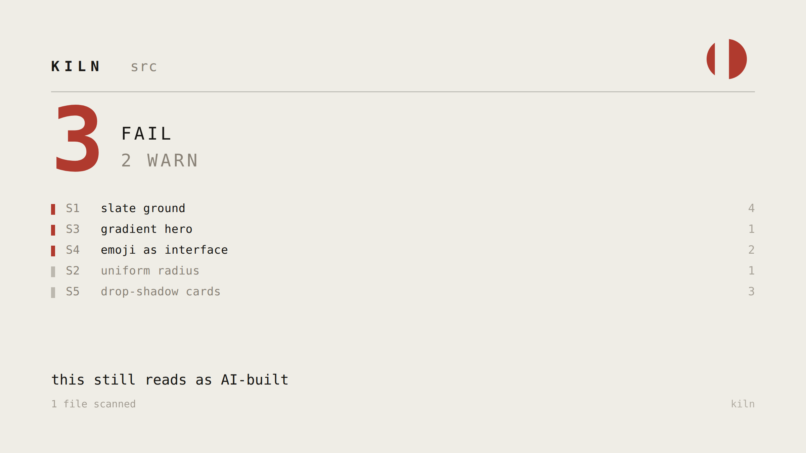

<div align="center">

# kiln

**Tell whether an interface looks AI-built — and say exactly why.**

MIT · zero dependencies · one file to run

</div>



---

## The problem

Told to "make it look good," a model returns **the mean of everything it has seen.**

The mean is slate `#64748b`, `border-radius: 0.5rem` on everything, a purple-to-blue gradient hero, emoji bullets, `shadow-lg` cards, Inter, and everything centered in a `max-w-7xl` container. You can spot it in half a second, and so can everyone else.

It is not that the model has no taste. **"Make it look good" contains zero constraints**, so there is nothing to push it away from the mean.

kiln finds the places where nothing pushed back.

## Run it

```bash
node check.js src/
```

Only Node. No install, no config, no network. Exit 1 on any failure, so it drops straight into CI:

```yaml
- run: node kiln/check.js src/
```

Draw the result as an image:

```bash
node card.js src/ --png
```



The gap in the mark widens with the failure count. Colors come from your project's `DESIGN.md` if it has one, so every project's card looks like that project.

## Where it earns its keep

**Right after an agent writes frontend code.** This is the main one. A model will hand you the mean and call it finished, and you will not notice until it is in front of someone else.

**In CI, as the last gate before a UI ships.** Rules nobody checks are decoration.

**On a design you can't articulate a problem with.** "It feels generic" is not actionable. `S1 slate ground · src/App.jsx:3` is.

**On your own old work.** This is where it stings.

## What it flags

Four **failures** — unambiguous, cannot be silenced:

| | | |
|---|---|---|
| `S1` | slate ground | the framework default — the literal mode of the training data. Nobody picked it. |
| `S3` | gradient hero | ornament with no function. Delete it and nothing stops working. |
| `S4` | emoji as interface | someone else's glyphs, in a drawing style you did not choose. |
| `S8` | two languages in one view | `TODAY 今日` is not bilingual design, it is an unfinished decision. |

Six **warnings** — each has a legitimate use:

`S2` uniform radius · `S5` drop-shadow cards · `S6` one-typeface system · `S7` unmeasured type scale · `S9` perfect circles everywhere · `S10` centered-everything layout

Declare a deliberate exception in `DESIGN.md` and the warning goes quiet:

```
kiln-allow: S9 the product is machined; perfect circles are intentional
```

Failures cannot be silenced. That is the point.

Every signature, with the reasoning: [`slop.md`](slop.md).

## What to do instead

A linter that only says *no* is half a tool. [`rules.md`](rules.md) has the four rules the signatures come from, each with the failure that produced it.

**1 · Skeleton invariants.** Position, size, spacing and element order are locked; a variant may change colour, radius, texture, type and language, and nothing else.
> Position and size are discipline. Form and type are personality.

**2 · Ornament needs a reason.** Every mark must answer *what problem does it solve?* Legal: giving an existing functional element a new face. Illegal: anything added to look designed.
> A texture is not something you paste. Extract its glyph vocabulary and make it your components.

**3 · Four gates for any human-readable unit.** Would it work on another skin / can an outsider read it / have you actually waited through it / **does it really take that long?**
> A 6-minute wait was once labeled "about as long as replying to one message." Replying takes thirty seconds. That is not weak copy, that is a broken converter — and a converter that converts wrong is worse than none.

**4 · One language at a time.** Complete packs per language; a missing field fails the build.

## Measuring type

`S7` fires when every size comes off a default ramp.

```bash
node measure-type.js --family "Noto Serif SC" --weight 900 --target 28
# → font-size: 41.8px   (ink height 28.0px)
```

Renders the glyphs, measures the ink bounding box, solves back for the size that produces your target cap height. **Lock the cap height, never the `font-size`** — a serif and a mono at the same `font-size` are not the same optical height, so anything switchable visibly jumps.

Expect ugly numbers. `41.8px` is what measured looks like; `40px` is what a config file looks like.

## As a Claude Code skill

```bash
git clone https://github.com/Kerrywang64/kiln ~/.claude/skills/kiln
```

Then just work. It loads when a design needs checking, and stays quiet when one doesn't.

## Try it

```bash
node check.js before.html
```

`before.html` is a deliberately average page. It scores 4 fail, 5 warn.

---

<div align="center">
<sub>MIT. The rules came from being told, repeatedly, that it wasn't good enough.</sub>
</div>
